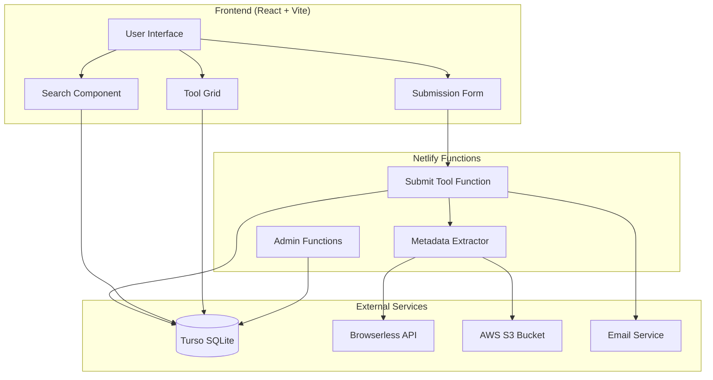

# Design Document

## Overview

Makerbench is a React-based web application that serves as a developer tool discovery platform. The system consists of a frontend React application, Netlify Functions for backend processing, and integrates with multiple external services (Turso database, Browserless API, AWS S3) to provide a complete tool submission and discovery experience.

The architecture follows a serverless approach using Netlify's platform, with the frontend handling user interactions and search functionality, while backend functions manage tool submission processing, metadata extraction, and admin notifications.

## Architecture

### High-Level Architecture



### Data Flow

1. **Tool Discovery Flow**: User searches → Frontend queries Turso → Results displayed in grid
2. **Tool Submission Flow**: User submits form → Netlify function processes → Metadata extracted → Screenshot captured → Data stored → Admin notified
3. **Admin Review Flow**: Admin receives notification → Reviews tool → Updates approval status → Tool becomes visible

## Components and Interfaces

### Frontend Components

#### Core Layout Components

**AppLayout Component**

- Renders main application structure with header, search, and content areas
- Manages global state for search and form visibility
- Implements responsive design breakpoints
- Provides semantic HTML structure for accessibility

**Header Component**

- Displays Makerbench logo and branding
- Implements proper heading hierarchy (h1 for main title)
- Includes skip navigation links for accessibility

#### Search and Discovery Components

**SearchBar Component**

```typescript
interface SearchBarProps {
  onSearch: (query: string) => void;
  placeholder?: string;
  ariaLabel?: string;
}
```

- Implements debounced search input (300ms delay)
- Provides real-time search suggestions
- Includes clear search functionality
- Supports keyboard navigation (Enter to search, Escape to clear)

**ToolGrid Component**

```typescript
interface ToolGridProps {
  tools: Tool[];
  loading: boolean;
  error?: string;
}
```

- Renders responsive CSS Grid layout
- Uses native HTML `loading="lazy"` for image performance
- Handles empty states and error states
- Provides keyboard navigation between tool cards

**ToolCard Component**

```typescript
interface ToolCardProps {
  tool: Tool;
  onImageError: (toolId: string) => void;
}
```

- Displays tool information with proper semantic markup
- Uses native HTML `loading="lazy"` attribute for image lazy loading
- Provides fallback for missing screenshots using `onerror` event
- Includes proper link accessibility (external link indicators)

#### Form Components

**ToolSubmissionForm Component**

```typescript
interface ToolSubmissionFormProps {
  onSubmit: (data: ToolSubmissionData) => Promise<void>;
  onCancel: () => void;
  isVisible: boolean;
}
```

- Uses native HTML5 form validation with Zod schema validation
- Leverages HTML `required`, `type="url"`, and `pattern` attributes
- Provides accessible error messaging using native form validation API
- Supports progressive enhancement with JavaScript validation layer
- Includes proper form labeling and fieldset grouping

**TagInput Component**

```typescript
interface TagInputProps {
  value: string[];
  onChange: (tags: string[]) => void;
  suggestions?: string[];
}
```

- Handles comma-separated tag input
- Provides tag suggestions based on existing tags
- Implements tag removal functionality
- Supports keyboard navigation for tag management

### Backend API Interfaces

#### Netlify Functions

**Submit Tool Function** (`/.netlify/functions/submit-tool`)

```typescript
interface SubmitToolRequest {
  url: string;
  githubUrl?: string;
  tags: string[];
  submitterName?: string;
  submitterGithubUrl?: string;
}

interface SubmitToolResponse {
  success: boolean;
  message: string;
  toolId?: string;
}
```

**Get Tools Function** (`/.netlify/functions/get-tools`)

```typescript
interface GetToolsRequest {
  search?: string;
  tags?: string[];
  limit?: number;
  offset?: number;
}

interface GetToolsResponse {
  tools: Tool[];
  total: number;
  hasMore: boolean;
}
```

### Data Models

#### Zod Validation Schemas

```typescript
import { z } from "zod";

// URL validation schema
const urlSchema = z.string().url("Please enter a valid URL");

// Tool submission validation
export const toolSubmissionSchema = z.object({
  url: urlSchema,
  githubUrl: z
    .string()
    .url("Please enter a valid GitHub URL")
    .optional()
    .or(z.literal("")),
  tags: z
    .array(z.string().min(1, "Tag cannot be empty"))
    .min(1, "At least one tag is required"),
  submitterName: z.string().optional(),
  submitterGithubUrl: z
    .string()
    .url("Please enter a valid GitHub URL")
    .optional()
    .or(z.literal("")),
});

// Tool data schema
export const toolSchema = z.object({
  id: z.string().uuid(),
  url: urlSchema,
  title: z.string(),
  description: z.string(),
  imageUrl: z.string().url().optional(),
  githubUrl: z.string().url().optional(),
  tags: z.array(tagSchema),
  submitter: submitterSchema.optional(),
  status: z.enum(["pending", "approved", "rejected"]),
  createdAt: z.string().datetime(),
  approvedAt: z.string().datetime().optional(),
});

// Tag schema
export const tagSchema = z.object({
  id: z.string().uuid(),
  name: z.string().min(1, "Tag name is required"),
  description: z.string().optional(),
});

// Submitter schema
export const submitterSchema = z.object({
  name: z.string().min(1, "Name is required"),
  githubUrl: z.string().url("Please enter a valid GitHub URL"),
});

// Tool metadata schema
export const toolMetadataSchema = z.object({
  title: z.string().optional(),
  description: z.string().optional(),
  imageUrl: z.string().url().optional(),
  screenshotUrl: z.string().url().optional(),
  extractedAt: z.string().datetime(),
});
```

#### TypeScript Types (Inferred from Zod)

```typescript
export type Tool = z.infer<typeof toolSchema>;
export type Tag = z.infer<typeof tagSchema>;
export type Submitter = z.infer<typeof submitterSchema>;
export type ToolMetadata = z.infer<typeof toolMetadataSchema>;
export type ToolSubmissionData = z.infer<typeof toolSubmissionSchema>;
```

#### Database Schema Extensions

The existing schema needs minor modifications to support submitter information:

```sql
-- Add submitter fields to bookmarks table
ALTER TABLE bookmarks ADD COLUMN submitter_name TEXT;
ALTER TABLE bookmarks ADD COLUMN submitter_github_url TEXT;
ALTER TABLE bookmarks ADD COLUMN github_url TEXT;
ALTER TABLE bookmarks ADD COLUMN image_url TEXT;
```

## Error Handling

### Frontend Error Handling

**Network Errors**

- Implement retry logic for failed API requests
- Display user-friendly error messages
- Provide offline state detection and messaging
- Cache successful responses for offline viewing

**Form Validation Errors**

- Real-time validation with debounced feedback
- Accessible error announcements using ARIA live regions
- Field-level and form-level error states
- Clear error recovery instructions

**Image Loading Errors**

- Fallback to placeholder images for missing screenshots
- Retry mechanism for failed image loads
- Progressive image loading with blur-up effect

### Backend Error Handling

**Metadata Extraction Failures**

- Graceful degradation when page metadata is unavailable
- Fallback to basic URL information
- Logging for debugging failed extractions

**Screenshot Generation Failures**

- Retry logic for Browserless API failures
- Fallback to default placeholder images
- Error logging and admin notifications for persistent failures

**Database Operation Failures**

- Transaction rollback for failed submissions
- Proper error responses to frontend
- Database connection retry logic

## Testing Strategy

### Frontend Testing

**Unit Tests**

- Component rendering and prop handling
- Form validation logic
- Search functionality and debouncing
- Tag parsing and management
- Accessibility compliance testing

**Integration Tests**

- API integration with Netlify functions
- Search flow from input to results display
- Form submission flow with success/error states
- Image loading and error handling

**End-to-End Tests**

- Complete tool submission workflow
- Search and discovery user journeys
- Responsive design across device sizes
- Keyboard navigation and screen reader compatibility

### Backend Testing

**Function Tests**

- Metadata extraction from various URL types
- Screenshot generation and S3 upload
- Database operations and error handling
- Email notification functionality

**API Contract Tests**

- Request/response validation
- Error response formats
- Rate limiting behavior

### Performance Testing

**Frontend Performance**

- Core Web Vitals measurement
- Bundle size optimization
- Image loading performance
- Search response times

**Backend Performance**

- Function cold start optimization
- Database query performance
- External API response times
- Concurrent request handling

### Accessibility Testing

**Automated Testing**

- axe-core integration for automated a11y checks
- Color contrast validation
- Semantic HTML structure validation

**Manual Testing**

- Screen reader navigation testing
- Keyboard-only navigation
- Focus management and visual indicators
- ARIA label and description accuracy

## CSS Architecture and Design System

### Design Token Structure

```css
:root {
  /* Color Palette */
  --color-primary-50: #f0f9ff;
  --color-primary-500: #3b82f6;
  --color-primary-900: #1e3a8a;

  --color-neutral-50: #f9fafb;
  --color-neutral-500: #6b7280;
  --color-neutral-900: #111827;

  --color-success-500: #10b981;
  --color-error-500: #ef4444;
  --color-warning-500: #f59e0b;

  /* Typography */
  --font-family-sans: system-ui, -apple-system, sans-serif;
  --font-family-mono: "SF Mono", Monaco, monospace;

  --font-size-xs: 0.75rem;
  --font-size-sm: 0.875rem;
  --font-size-base: 1rem;
  --font-size-lg: 1.125rem;
  --font-size-xl: 1.25rem;
  --font-size-2xl: 1.5rem;
  --font-size-3xl: 1.875rem;

  --font-weight-normal: 400;
  --font-weight-medium: 500;
  --font-weight-semibold: 600;
  --font-weight-bold: 700;

  --line-height-tight: 1.25;
  --line-height-normal: 1.5;
  --line-height-relaxed: 1.75;

  /* Spacing */
  --space-1: 0.25rem;
  --space-2: 0.5rem;
  --space-3: 0.75rem;
  --space-4: 1rem;
  --space-6: 1.5rem;
  --space-8: 2rem;
  --space-12: 3rem;
  --space-16: 4rem;

  /* Layout */
  --container-max-width: 1200px;
  --grid-gap: var(--space-6);
  --border-radius-sm: 0.25rem;
  --border-radius-md: 0.5rem;
  --border-radius-lg: 0.75rem;

  /* Shadows */
  --shadow-sm: 0 1px 2px 0 rgb(0 0 0 / 0.05);
  --shadow-md: 0 4px 6px -1px rgb(0 0 0 / 0.1);
  --shadow-lg: 0 10px 15px -3px rgb(0 0 0 / 0.1);

  /* Transitions */
  --transition-fast: 150ms ease-in-out;
  --transition-normal: 250ms ease-in-out;
  --transition-slow: 350ms ease-in-out;
}
```

### Component Architecture

**Base Styles** (`src/styles/base.css`)

- CSS reset and normalization
- Typography base styles
- Focus management styles
- Print styles

**Layout Styles** (`src/styles/layout.css`)

- Container and grid systems
- Responsive breakpoint utilities
- Flexbox utilities

**Component Styles** (`src/styles/components/`)

- Individual component stylesheets
- BEM methodology for class naming
- Component-specific custom properties

### Responsive Design Strategy

**Breakpoint System**

```css
/* Mobile-first approach */
@media (min-width: 640px) {
  /* sm */
}
@media (min-width: 768px) {
  /* md */
}
@media (min-width: 1024px) {
  /* lg */
}
@media (min-width: 1280px) {
  /* xl */
}
```

**Grid Layout**

- CSS Grid for tool card layout
- Responsive column counts based on viewport
- Flexible gap spacing using design tokens

## Performance Optimization

### Frontend Optimization

**Code Splitting**

- Route-based code splitting for admin functionality
- Component-level lazy loading for heavy components
- Dynamic imports for non-critical features

**Asset Optimization**

- Image optimization with WebP format support using `<picture>` element
- Native lazy loading for tool screenshots using `loading="lazy"`
- Critical CSS inlining

**Caching Strategy**

- Service worker for offline functionality
- API response caching with appropriate TTL
- Static asset caching with versioning

### Backend Optimization

**Function Optimization**

- Minimize cold start times through bundling
- Connection pooling for database operations
- Efficient metadata extraction algorithms

**Database Optimization**

- Proper indexing for search queries
- Query optimization for tag-based searches
- Connection management and pooling

## Security Considerations

### Input Validation

- URL validation and sanitization
- Tag input sanitization
- XSS prevention in user-generated content

### API Security

- Rate limiting on submission endpoints
- CORS configuration for frontend domains
- Input validation on all function endpoints

### Data Protection

- Secure handling of admin email addresses
- Proper error message sanitization
- Secure S3 bucket configuration with appropriate permissions
