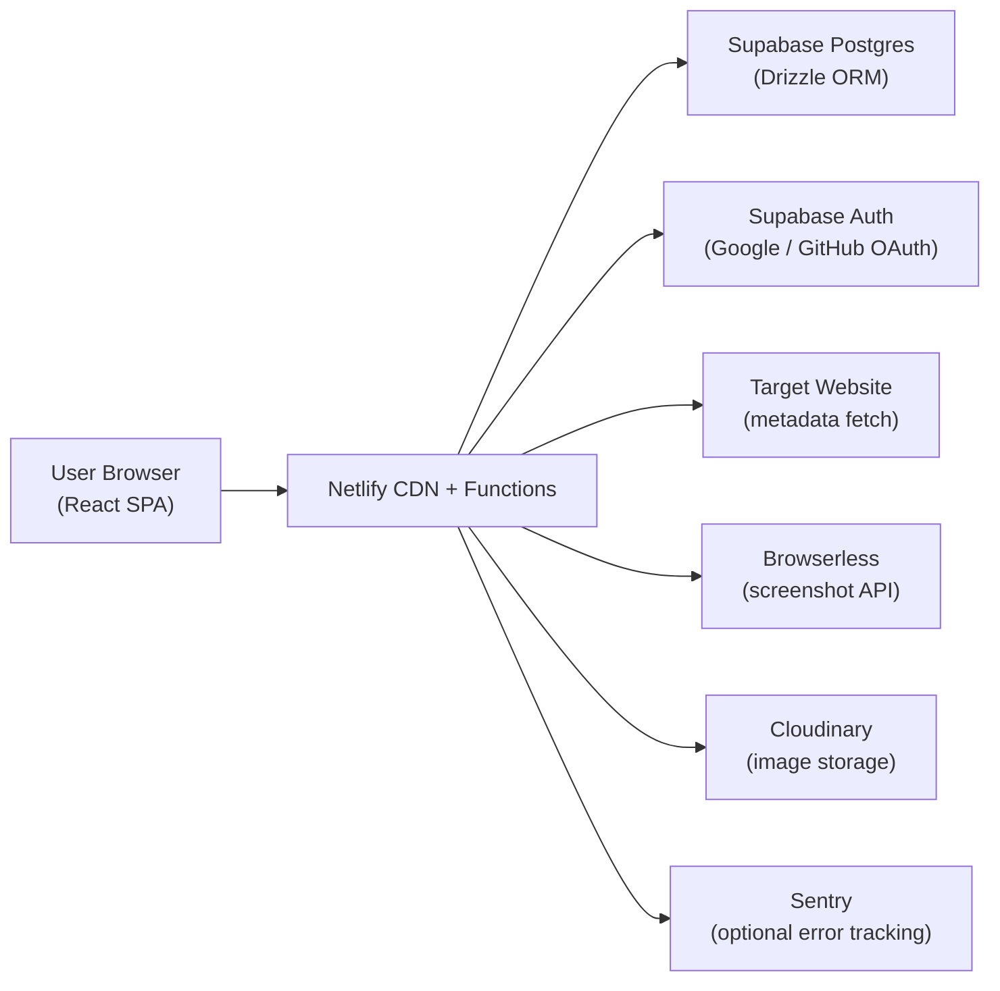
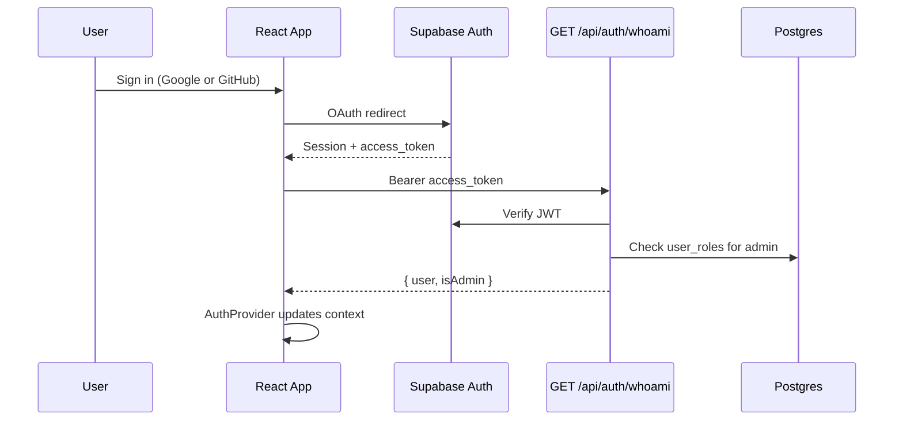
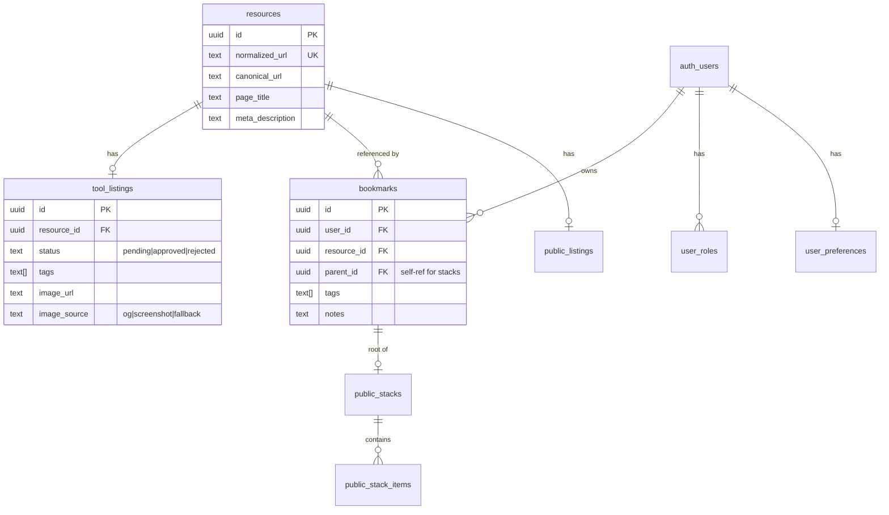
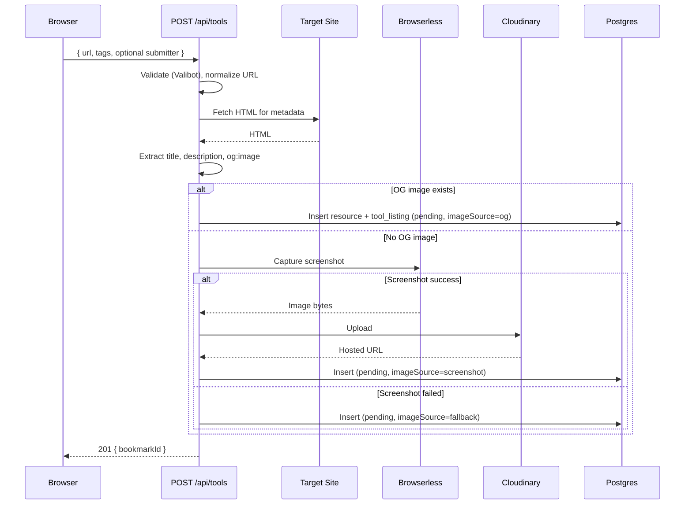
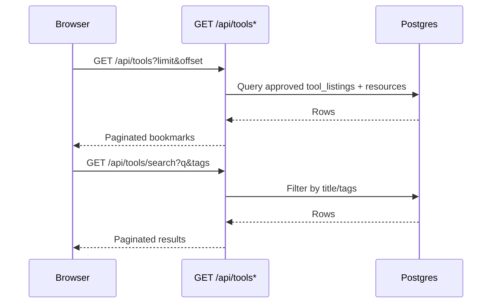
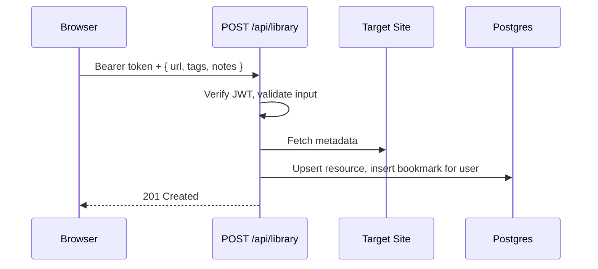
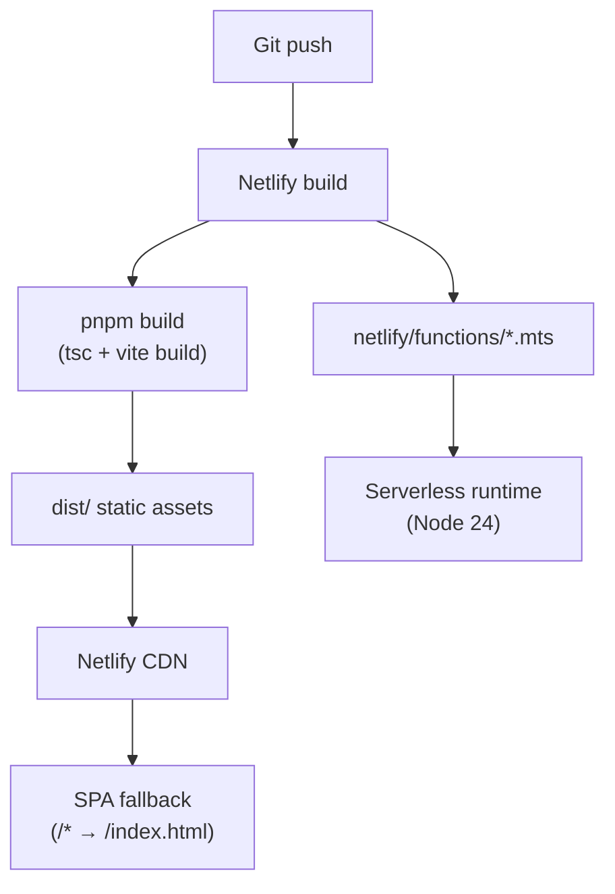

# MakerBench Architecture

Last updated: May 30, 2026

This document is the canonical technical reference for how MakerBench is structured, how data flows through the system, and what is planned next.

## Purpose

MakerBench is a curated bookmarking platform for developer and maker tools. Users can:

- **Browse** approved tools on the homepage (`/` or `/tools`)
- **Submit** new tools for moderation (`/submit`)
- **Discover** community-curated public resources and stacks (`/resources`)
- **Save** personal bookmarks to a private library when signed in (`/library`)

The platform separates **public tool listings** (moderated, anonymous submission) from **personal bookmarks** (authenticated, private) and **public resources** (LinkStack-derived community content).

## System Context



| Layer | Technology | Role |
| --- | --- | --- |
| Frontend | React 19, TypeScript, Vite | SPA with client-side routing |
| API | Netlify Functions (Node.js 24) | REST endpoints under `/api/*` |
| Database | Supabase Postgres | Primary data store |
| ORM | Drizzle | Schema, migrations, typed queries |
| Auth | Supabase Auth | OAuth (Google, GitHub); JWT verified server-side |
| Validation | Valibot | Shared request/response schemas |
| Screenshots | Browserless | Fallback when OG image is missing |
| Images | Cloudinary | Hosts generated screenshots |
| Secrets | Varlock + 1Password plugin | Local env loading; schema in `.env.schema` |
| Hosting | Netlify | Static build + serverless functions |
| Component docs | Storybook 10 | Colocated stories, MSW preview, Vitest interaction tests |

## Repository Structure

```
makerbench-next/
├── src/                      # Frontend application
│   ├── api/                  # HTTP client layer (fetch + Valibot response validation)
│   ├── components/           # UI components (bookmarks, forms, layout, resources, search, tags, ui)
│   │   └── **/*.stories.tsx  # Colocated Storybook stories (where present)
│   ├── db/                   # Drizzle schema and query helpers (shared with functions)
│   ├── hooks/                # React hooks and AuthProvider
│   ├── lib/                  # Validation, services (metadata, screenshot, cloudinary), Supabase client
│   ├── pages/                # Route-level page components
│   └── styles/               # Pure CSS (tokens, reset, utilities, component styles)
├── netlify/
│   └── functions/            # Serverless API handlers
│       ├── lib/              # Shared function utilities (db, auth, responses, env, sentry)
│       └── *.mts             # One function per endpoint
├── migrations/postgres/      # Drizzle SQL migrations (Supabase Postgres)
├── e2e/                      # Playwright end-to-end tests
├── .storybook/               # Storybook config, preview decorators, MSW handlers
├── scripts/                  # One-off maintenance scripts (e.g. Turso import)
├── docs/                     # Supplementary guides (local dev, deployment)
├── netlify.toml              # Build, publish, SPA redirect config
├── drizzle.config.ts         # Drizzle Kit configuration
└── vite.config.ts            # Vite + React Compiler + Varlock plugin
```

**Shared code boundary:** `src/db/schema.ts`, `src/lib/validation.ts`, and `src/lib/services/*` are imported by both the frontend build and Netlify Functions. This keeps validation and business logic in one place.

## Frontend Architecture

### Application shell

- **Entry:** `src/main.tsx` mounts `App` inside React `StrictMode`.
- **Routing:** React Router v7 in `src/App.tsx` wraps all pages in `MainLayout` and `AuthProvider`.
- **Pages:**

| Route | Page | Purpose |
| --- | --- | --- |
| `/`, `/tools` | `HomePage` | Browse and search approved tools |
| `/resources` | `ResourcesPage` | Browse and search public resources/stacks |
| `/library` | `LibraryPage` | Authenticated personal bookmark library |
| `/submit` | `SubmitPage` | Submit a tool for moderation |
| `/about` | `AboutPage` | About the project |
| `/privacy` | `PrivacyPage` | Privacy policy |
| `*` | `NotFoundPage` | 404 |

### Component organization

Components are grouped by feature domain, not by atomic design tier:

- `components/ui/` — reusable primitives (Button, Alert, TextInput, Icon, …)
- `components/layout/` — Header, Footer, MainLayout
- `components/bookmarks/` — ToolCard, ToolGrid (public tools)
- `components/resources/` — ResourceCard, ResourceGrid (public resources)
- `components/search/` — SearchInput
- `components/forms/` — TagInput
- `components/tags/` — TagBadge, TagCloud

The project prefers **semantic HTML and web platform primitives**, with React used to enhance interactivity where native elements fall short.

### Styling

- **Pure CSS** — no CSS frameworks or preprocessors.
- **Design tokens** in `src/styles/tokens.css`; base styles in `src/styles/index.css`.
- **Shared-first responsive CSS** — bounded media queries, logical properties, no vendor prefixes.
- Component styles live alongside components (e.g. `Button.css` next to `Button.tsx`).

### State and data fetching

| Hook | Data source | Used by |
| --- | --- | --- |
| `useBookmarks` | `GET /api/tools` | HomePage |
| `useSearch` | `GET /api/tools/search` | HomePage |
| `useTags` | `GET /api/tools/tags` | HomePage |
| `useResources` | `GET /api/resources` | ResourcesPage |
| `useResourceSearch` | `GET /api/resources/search` | ResourcesPage |
| `useLibraryResources` | `GET /api/library` | LibraryPage |
| `useSubmitBookmark` | `POST /api/tools` | SubmitPage |
| `useAuth` | Supabase session + `GET /api/auth/whoami` | Header, LibraryPage |

Filter state (search query, tags, sort) is synced to URL search params so views are shareable.

### API client layer

Located in `src/api/`. Each module:

1. Calls the Netlify Function endpoint via `fetch`
2. Parses JSON error bodies for structured `{ error, details }` responses
3. Validates success payloads with Valibot schemas
4. Throws typed errors (e.g. `BookmarkApiError`) for consumers to handle

See `src/api/bookmarks.ts` for the reference pattern.

### Authentication



- Client: `@supabase/supabase-js` in `src/lib/supabase.ts`; `AuthProvider` in `src/hooks/AuthProvider.tsx`
- Server: `verifyAuthenticatedUser()` in `netlify/functions/lib/auth.ts` validates Bearer tokens and loads admin role from `user_roles`
- Protected endpoints: `POST /api/library`, `GET /api/library` (personal bookmarks)

## Backend Architecture

### Netlify Functions

Each API endpoint is a standalone `.mts` file exporting:

- A default `async (req, context) => Response` handler
- A `config` object with `path`, and optionally `method`

Shared utilities live in `netlify/functions/lib/`:

| Module | Responsibility |
| --- | --- |
| `db.ts` | Drizzle client (pg Pool, max 1 connection per invocation) |
| `auth.ts` | JWT verification, admin role lookup |
| `responses.ts` | Standard `{ success, data \| error }` JSON helpers |
| `env.ts` | Required env assertions, missing-env error handling |
| `url.ts` | URL parsing and normalization |
| `sentry.ts` | Optional error capture and flush |
| `tags.ts` | Tag normalization helpers |

### API surface

| Method | Path | Function file | Auth | Description |
| --- | --- | --- | --- | --- |
| `POST` | `/api/tools` | `process-bookmark.mts` | No | Submit tool (stored as `pending`) |
| `GET` | `/api/tools` | `get-bookmarks.mts` | No | List approved tools (paginated) |
| `GET` | `/api/tools/search` | `search-bookmarks.mts` | No | Search/filter approved tools |
| `GET` | `/api/tools/tags` | `get-tags.mts` | No | Tag cloud with usage counts |
| `GET` | `/api/resources` | `get-resources.mts` | No | List approved public resources/stacks |
| `GET` | `/api/resources/search` | `search-resources.mts` | No | Search public resources/stacks |
| `GET` | `/api/library` | `get-library.mts` | Yes | List user's personal bookmarks |
| `POST` | `/api/library` | `add-library.mts` | Yes | Add URL to personal library |
| `GET` | `/api/auth/whoami` | `auth-whoami.mts` | Yes | Return authenticated identity + admin flag |

All responses follow a consistent envelope:

```typescript
// Success
{ success: true, data: T }

// Error
{ success: false, error: string, details?: Record<string, string[]> }
```

### Validation

Valibot schemas in `src/lib/validation.ts` define:

- Tool submission (`toolSubmissionSchema`)
- Personal library entries (`personalResourceRequestSchema`)
- Tag constraints (1–10 tags, max 50 chars each)
- URL normalization rules (HTTP/HTTPS only, max 2000 chars)

Functions call `validate*()` helpers; the frontend reuses the same schemas for form validation.

### External service integrations

**Metadata extraction** (`src/lib/services/metadata.ts`):

- Fetches target URL HTML with a 15s timeout
- Parses title, description, and `og:image` via Cheerio

**Screenshot fallback** (`src/lib/services/screenshot.ts`):

- Called when no OG image is found during tool submission
- Uses Browserless REST API with `gotoOptions.waitUntil: "networkidle2"`
- Supports `png` and `jpeg` output only (not WebP)

**Image storage** (`src/lib/services/cloudinary.ts`):

- Uploads screenshot bytes to Cloudinary
- Frontend consumes hosted URLs; delivery can use `f_auto,q_auto` transforms

**Error tracking** (`netlify/functions/lib/sentry.ts`):

- Optional; initialized when `SENTRY_DSN` is configured

## Data Architecture

### Database

Supabase Postgres is the single source of truth. Drizzle ORM provides:

- Type-safe schema in `src/db/schema.ts`
- Migrations in `migrations/postgres/` (driven by `migrations/postgres/meta/_journal.json`)
- Query helpers in `src/db/queries/`

Apply migrations with `pnpm db:migrate`. Generate new migrations with `pnpm db:generate` after schema changes.

**Important:** Schema changes must be migrated to production *before* deploying code that depends on new columns.

### Entity model



| Table | Purpose |
| --- | --- |
| `resources` | Canonical URL identity shared across all listing types |
| `tool_listings` | Public tool submissions with moderation status and preview image |
| `bookmarks` | Per-user personal bookmarks (private library) |
| `public_listings` | Approved community resources (LinkStack migration) |
| `public_stacks` | Curated multi-item resource stacks |
| `public_stack_items` | Items within a public stack |
| `user_roles` | Admin role assignments |
| `user_preferences` | User settings (e.g. highlight color) |
| `auth.users` | Supabase-managed auth users (referenced, not owned) |

**Status workflow:** Submissions across `tool_listings`, `public_listings`, `public_stacks`, and `public_stack_items` use `pending | approved | rejected`. Public endpoints return only `approved` rows. A unified admin moderation queue is not yet implemented — see [#105](https://github.com/schalkneethling/makerbench-next/issues/105).

Search indexes use PostgreSQL GIN + `pg_trgm` on concatenated title, description, and tags for public resources.

## Key Flows

### Submit a tool



### Browse and search tools



### Add to personal library (authenticated)



## Testing Architecture

| Layer | Tool | Location | Focus |
| --- | --- | --- | --- |
| Unit / component | Vitest + Testing Library + happy-dom | `src/**/__tests__/` | Hooks, components, validation, API clients |
| Function | Vitest | `netlify/functions/__tests__/` | Endpoint handlers, shared lib |
| Storybook | Storybook 10 + Vitest browser (Playwright) | `src/**/*.stories.tsx`, `.storybook/` | Isolated component render, play functions, a11y addon |
| E2e | Playwright | `e2e/` | Page structure via ARIA snapshots, user flows |

Run `pnpm test` for unit/component/function tests (always exits; never watch mode in CI). Run `npx vitest --project storybook run` for Storybook interaction tests. Run `pnpm test:e2e` for Playwright (starts Vite dev server automatically). Run `pnpm storybook` for the component workshop UI.

API tests use MSW (`src/test/mocks/`) for frontend client tests. Storybook uses MSW via `msw-storybook-addon` (handlers in `.storybook/msw-handlers.ts`; worker in `public/`). The Vitest **storybook** project does not load `src/test/setup.ts` (Node MSW server) — only the unit and components projects do. Function tests use direct handler invocation with mocked dependencies.

### Storybook setup (May 2026)

- **Framework:** `@storybook/react-vite` (Storybook 10.4.x)
- **Preview:** `.storybook/preview.tsx` imports `src/index.css`, wraps stories in `AuthProvider` + `BrowserRouter`, and registers MSW loaders/handlers
- **Static assets:** `staticDirs: ['../public']` in `.storybook/main.ts` (includes MSW service worker)
- **Env:** Varlock Vite plugin merged in `viteFinal` so `VITE_SUPABASE_*` matches the main app
- **Stories tagged** `ai-generated` in meta; stories with passing Vitest runs should not carry `needs-work`

**Components with stories today:** Button, Alert, LoadMoreButton, ResultCount, TagBadge, TagCloud, SearchInput, TagInput, ToolCard, ToolCardSkeleton.

**Not yet covered:** route pages, Header/Footer/MainLayout, ResourceCard, and other data-fetching views.

## Build and Deployment



- **Build command:** `pnpm build` (TypeScript project references + Vite)
- **Publish directory:** `dist/`
- **Functions directory:** `netlify/functions`
- **SPA routing:** `netlify.toml` redirects all paths to `index.html`
- **Local dev:** `netlify dev` proxies Vite and functions together (see `docs/local-development.md`)

Database migrations are applied separately via `pnpm db:migrate` against the target Supabase Postgres URL — they are not part of the Netlify build step.

## Environment Variables

Defined in `.env.schema` (Varlock). Key variables:

| Variable | Scope | Purpose |
| --- | --- | --- |
| `SUPABASE_DATABASE_URL` | Server only | Postgres connection (pooler URL recommended) |
| `VITE_SUPABASE_URL` | Client + server | Supabase project URL |
| `VITE_SUPABASE_ANON_KEY` | Client + server | Supabase anon key (JWT verification) |
| `CLOUDINARY_*` | Server only | Screenshot upload |
| `BROWSERLESS_API_KEY` | Server only | Screenshot capture |
| `SENTRY_DSN` | Server only | Optional error tracking |

Server-side functions read secrets via `Netlify.env.get()`. Client-visible vars use the `VITE_` prefix and are bundled by Vite.

## Current Gaps and Roadmap

| Area | Status |
| --- | --- |
| Tool submission pipeline | Implemented (`pending` status) |
| Public browse/search | Implemented |
| Personal library (auth) | Implemented |
| Public resources/stacks | Implemented |
| Moderation API + admin UI | **Not implemented** — unified queue needed for tools, public resources, stacks, and stack items ([#105](https://github.com/schalkneethling/makerbench-next/issues/105)) |
| Algolia search | Planned post-MVP |

See [ROADMAP.md](./ROADMAP.md) and [GitHub Issues](https://github.com/schalkneethling/makerbench-next/issues) for active backlog.

## Source Pointers

| Concern | Location |
| --- | --- |
| Routes | `src/App.tsx` |
| Tool browse/search | `src/pages/HomePage.tsx` |
| Tool submission | `src/pages/SubmitPage.tsx` |
| Personal library | `src/pages/LibraryPage.tsx` |
| Public resources | `src/pages/ResourcesPage.tsx` |
| API clients | `src/api/` |
| Validation schemas | `src/lib/validation.ts` |
| Database schema | `src/db/schema.ts` |
| Submit handler | `netlify/functions/process-bookmark.mts` |
| List/search handlers | `netlify/functions/get-bookmarks.mts`, `search-bookmarks.mts` |
| Auth handler | `netlify/functions/auth-whoami.mts` |
| Library handlers | `netlify/functions/get-library.mts`, `add-library.mts` |
| Function shared libs | `netlify/functions/lib/` |
| Migrations | `migrations/postgres/` |
| Storybook config | `.storybook/main.ts`, `.storybook/preview.tsx`, `.storybook/msw-handlers.ts` |
| Component stories | `src/components/**/*.stories.tsx` |

## Related Documentation

- [Local development](./docs/local-development.md)
- [Production deployment](./docs/production-deployment.md)
- [Database setup](./DATABASE_SETUP.md)
- [Agent instructions](./AGENTS.md)
