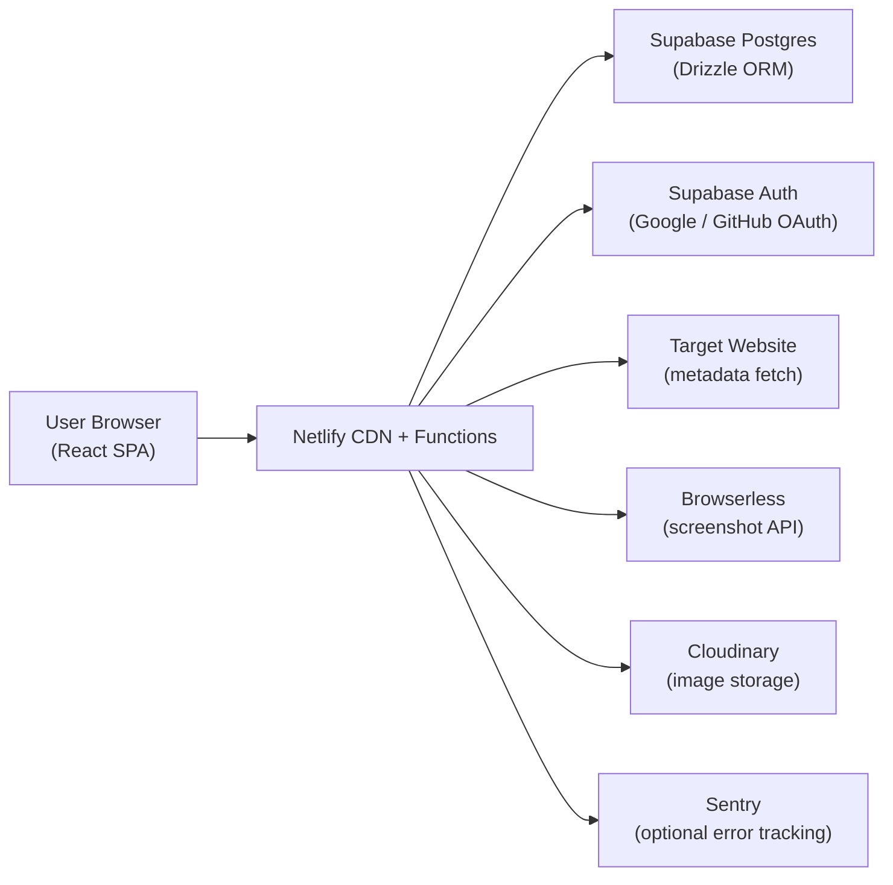
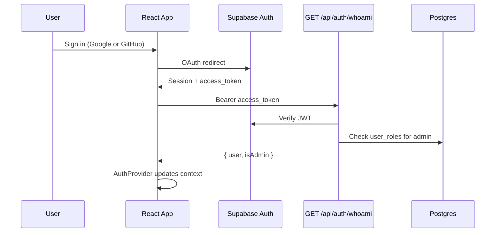
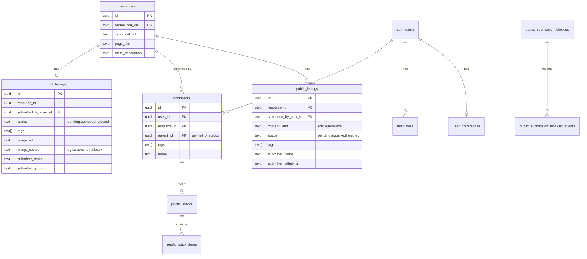
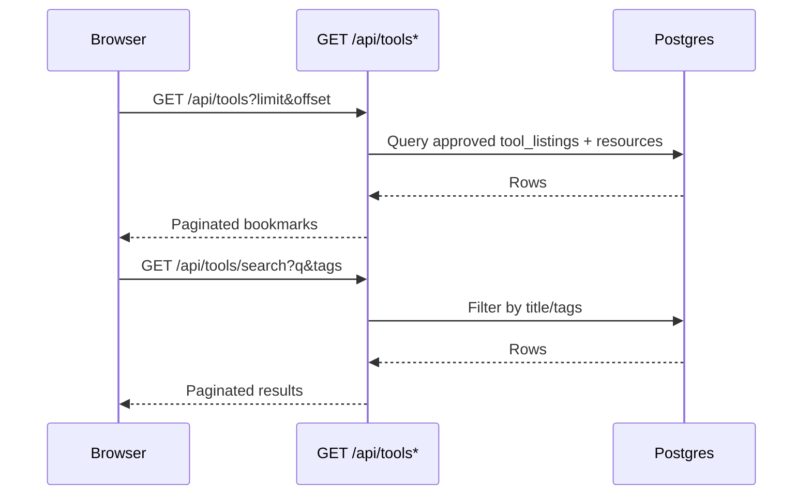
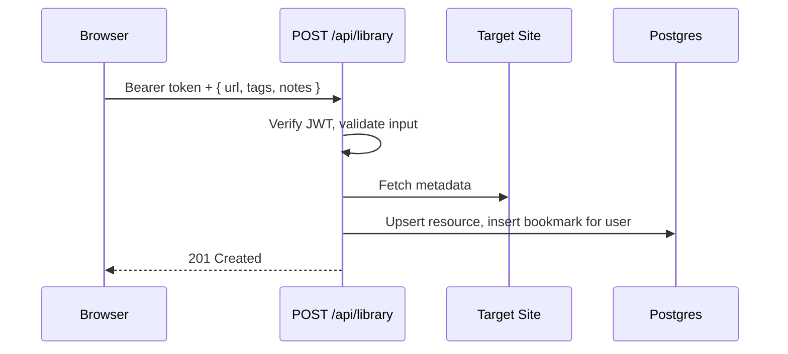
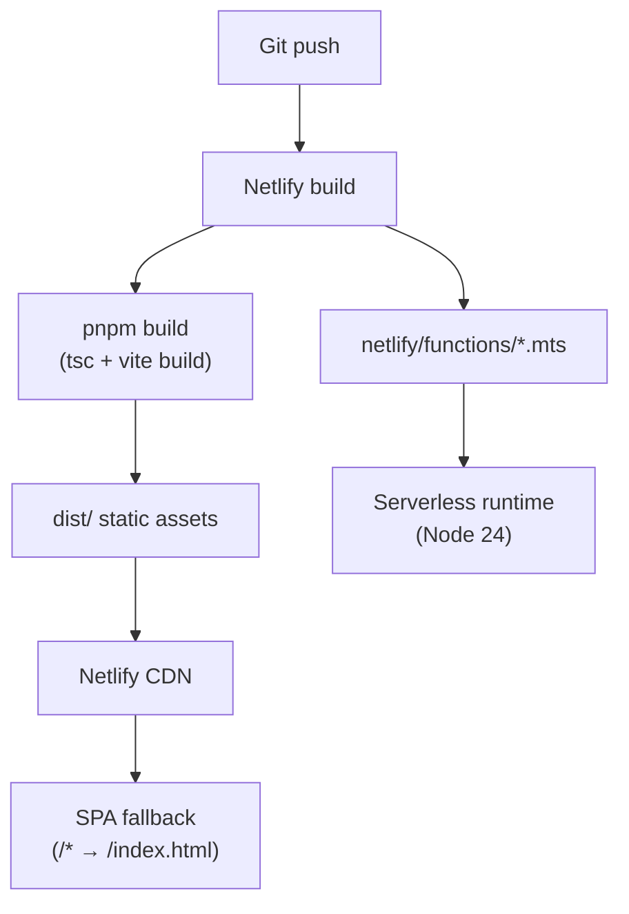

# MakerBench Architecture

Last updated: July 14, 2026

This document is the canonical technical reference for how MakerBench is structured, how data flows through the system, and what is planned next.

## Purpose

MakerBench is a curated bookmarking platform for developer and maker tools and resources. Users can:

- **Browse** approved tools on the homepage (`/` or `/tools`)
- **Submit** tools or resources for moderation (`/submit`)
- **Discover** approved public resources and stacks (`/resources`)
- **Save** personal bookmarks to a private library when signed in (`/library`)

The platform separates moderated **public tool listings** and **public resource listings** from authenticated, private **personal bookmarks**. Public submission does not require sign-in, but every submission requires attribution and remains pending until reviewed.

## System Context



| Layer          | Technology                     | Role                                                     |
| -------------- | ------------------------------ | -------------------------------------------------------- |
| Frontend       | React 19, TypeScript, Vite     | SPA with client-side routing                             |
| API            | Netlify Functions (Node.js 24) | REST endpoints under `/api/*`                            |
| Database       | Supabase Postgres              | Primary data store                                       |
| ORM            | Drizzle                        | Schema, migrations, typed queries                        |
| Auth           | Supabase Auth                  | OAuth (Google, GitHub); JWT verified server-side         |
| Validation     | Valibot                        | Shared request/response schemas                          |
| Screenshots    | Browserless                    | Fallback when OG image is missing                        |
| Images         | Cloudinary                     | Hosts generated screenshots                              |
| Secrets        | Varlock + 1Password plugin     | Local env loading; schema in `.env.schema`               |
| Hosting        | Netlify                        | Static build + serverless functions                      |
| Component docs | Storybook 10                   | Colocated stories, MSW preview, Vitest interaction tests |

## Repository Structure

```
makerbench-next/
├── src/                      # Frontend application
│   ├── api/                  # HTTP client layer (fetch + Valibot response validation)
│   ├── components/           # UI components (bookmarks, forms, layout, resources, search, tags, ui)
│   │   └── **/*.stories.tsx  # Colocated Storybook stories (where present)
│   ├── db/                   # Drizzle schema and query helpers (shared with functions)
│   ├── hooks/                # React hooks and AuthProvider
│   ├── lib/                  # Validation, services (metadata, screenshot, cloudinary), Supabase client
│   ├── pages/                # Route-level page components
│   └── styles/               # Pure CSS (tokens, reset, utilities, component styles)
├── netlify/
│   └── functions/            # Serverless API handlers
│       ├── lib/              # Shared function utilities (db, auth, responses, env, sentry)
│       └── *.mts             # One function per endpoint
├── migrations/postgres/      # Drizzle SQL migrations (Supabase Postgres)
├── e2e/                      # Playwright end-to-end tests
├── .storybook/               # Storybook config, preview decorators, MSW handlers
├── scripts/                  # One-off maintenance scripts (e.g. Turso import)
├── docs/                     # Supplementary guides (local dev, deployment)
├── netlify.toml              # Build, publish, SPA redirect config
├── drizzle.config.ts         # Drizzle Kit configuration
└── vite.config.ts            # Vite + React Compiler + Varlock plugin
```

**Shared code boundary:** `src/db/schema.ts`, `src/lib/validation.ts`, and `src/lib/services/*` are imported by both the frontend build and Netlify Functions. This keeps validation and business logic in one place.

## Frontend Architecture

### Application shell

- **Entry:** `src/main.tsx` mounts `App` inside React `StrictMode`.
- **Routing:** React Router v7 in `src/App.tsx` wraps all pages in `MainLayout` and `AuthProvider`.
- **Pages:**

| Route               | Page                  | Purpose                                   |
| ------------------- | --------------------- | ----------------------------------------- |
| `/`, `/tools`       | `HomePage`            | Browse and search approved tools          |
| `/resources`        | `ResourcesPage`       | Browse and search public resources/stacks |
| `/library`          | `LibraryPage`         | Authenticated personal bookmark library   |
| `/submit`           | `SubmitPage`          | Submit a tool or resource for moderation  |
| `/admin/moderation` | `AdminModerationPage` | Review pending public listings (admin)    |
| `/about`            | `AboutPage`           | About the project                         |
| `/privacy`          | `PrivacyPage`         | Privacy policy                            |
| `*`                 | `NotFoundPage`        | 404                                       |

### Component organization

Components are grouped by feature domain, not by atomic design tier:

- `components/ui/` — reusable primitives (Button, Alert, TextInput, Icon, …)
- `components/layout/` — Header, Footer, MainLayout
- `components/bookmarks/` — ToolCard, ToolGrid (public tools)
- `components/resources/` — ResourceCard, ResourceGrid (public resources)
- `components/search/` — SearchInput
- `components/forms/` — TagInput
- `components/tags/` — TagBadge, TagCloud

The project prefers **semantic HTML and web platform primitives**, with React used to enhance interactivity where native elements fall short.

### Styling

- **Pure CSS** — no CSS frameworks or preprocessors.
- **Design tokens** in `src/styles/tokens.css`; base styles in `src/styles/index.css`.
- **Shared-first responsive CSS** — bounded media queries, logical properties, no vendor prefixes.
- Component styles live alongside components (e.g. `Button.css` next to `Button.tsx`).

### State and data fetching

| Hook                      | Data source                               | Used by                        |
| ------------------------- | ----------------------------------------- | ------------------------------ |
| `useBookmarks`            | `GET /api/tools`                          | HomePage                       |
| `useSearch`               | `GET /api/tools/search`                   | HomePage                       |
| `useTags`                 | `GET /api/tools/tags`                     | HomePage                       |
| `useResources`            | `GET /api/resources`                      | ResourcesPage                  |
| `useResourceSearch`       | `GET /api/resources/search`               | ResourcesPage                  |
| `useLibraryResources`     | `GET/POST /api/library`                   | LibraryPage                    |
| `usePublicSubmission`     | `POST /api/submissions`                   | SubmitPage                     |
| `useAdminModerationQueue` | `GET/PATCH /api/admin/moderation`         | AdminModerationPage            |
| `useAuth`                 | Supabase session + `GET /api/auth/whoami` | Header, Library, Submit, Admin |

`useSubmitBookmark` remains as a legacy tool-only hook but delegates to the shared submission client. The current public submission UI uses `usePublicSubmission` and the binary `/api/submissions` contract; `POST /api/tools` remains a server compatibility route.

Filter state (search query, tags, sort) is synced to URL search params so views are shareable.

### API client layer

Located in `src/api/`. Each module:

1. Calls the Netlify Function endpoint via `fetch`
2. Parses JSON error bodies for structured `{ error, details }` responses
3. Validates success payloads with Valibot schemas
4. Throws typed errors (e.g. `BookmarkApiError`) for consumers to handle

See `src/api/bookmarks.ts` for the reference pattern.

### Authentication



- Client: `@supabase/supabase-js` in `src/lib/supabase.ts`; `AuthProvider` in `src/hooks/AuthProvider.tsx`
- Server: `verifyAuthenticatedUser()` in `netlify/functions/lib/auth.ts` validates Bearer tokens and loads admin role from `user_roles`
- Protected endpoints: `GET/POST /api/library` require a signed-in user;
  `/api/admin/moderation` and `/api/admin/blocklist` additionally require the
  verified `admin` role.
- Optional-auth endpoint: `POST /api/submissions` accepts no token or a Bearer token. An invalid supplied token is rejected rather than treated as anonymous.
- Submission identity: `GET /api/auth/whoami` exposes only verified display-name and GitHub metadata. `SubmitPage` waits for this lookup before deciding which attribution inputs are missing.

## Backend Architecture

### Netlify Functions

Each API endpoint is a standalone `.mts` file exporting:

- A default `async (req, context) => Response` handler
- A `config` object with `path`, and optionally `method`

Shared utilities live in `netlify/functions/lib/`:

| Module                    | Responsibility                                            |
| ------------------------- | --------------------------------------------------------- |
| `db.ts`                   | Drizzle client (pg Pool, max 1 connection per invocation) |
| `auth.ts`                 | JWT verification, admin role lookup                       |
| `responses.ts`            | Standard `{ success, data \| error }` JSON helpers        |
| `env.ts`                  | Required env assertions, missing-env error handling       |
| `url.ts`                  | URL parsing and normalization                             |
| `sentry.ts`               | Optional error capture and flush                          |
| `tags.ts`                 | Tag normalization helpers                                 |
| `submission-blocklist.ts` | Private URL/domain rules and redacted audit events        |

### API surface

| Method            | Path                    | Function file            | Auth            | Description                                              |
| ----------------- | ----------------------- | ------------------------ | --------------- | -------------------------------------------------------- |
| `POST`            | `/api/submissions`      | `public-submissions.mts` | Optional Bearer | Submit a tool or resource as `pending`                   |
| `POST`            | `/api/tools`            | `process-tool.mts`       | Optional Bearer | Legacy compatibility route; accepts tools only           |
| `GET`             | `/api/tools`            | `get-bookmarks.mts`      | No              | List approved tools (paginated)                          |
| `GET`             | `/api/tools/search`     | `search-bookmarks.mts`   | No              | Search/filter approved tools                             |
| `GET`             | `/api/tools/tags`       | `get-tags.mts`           | No              | Tag cloud with usage counts                              |
| `GET`             | `/api/resources`        | `get-resources.mts`      | No              | List approved public resources/stacks                    |
| `GET`             | `/api/resources/search` | `search-resources.mts`   | No              | Search public resources/stacks                           |
| `GET`             | `/api/library`          | `get-library.mts`        | Bearer          | List user's personal bookmarks                           |
| `POST`            | `/api/library`          | `add-library.mts`        | Bearer          | Add a URL to the personal library                        |
| `GET`             | `/api/auth/whoami`      | `auth-whoami.mts`        | Bearer          | Return verified identity and admin flag                  |
| `GET/PATCH`       | `/api/admin/moderation` | `admin-moderation.mts`   | Admin Bearer    | List or review pending moderation items                  |
| `GET/POST/DELETE` | `/api/admin/blocklist`  | `admin-blocklist.mts`    | Admin Bearer    | Manage private submission blocklist rules and audit data |

All responses follow a consistent envelope:

```typescript
// Success
{ success: true, data: T }

// Error
{ success: false, error: string, details?: Record<string, string[]> }
```

### Validation

Valibot schemas in `src/lib/validation.ts` define:

- Shared public submissions for tools and resources (`publicSubmissionRequestSchema`, `publicSubmissionResponseSchema`)
- Legacy tool compatibility submission (`toolSubmissionSchema`)
- Personal library entries (`personalResourceRequestSchema`)
- Tag constraints (1–10 tags, max 50 chars each)
- URL normalization rules (HTTP/HTTPS only, max 2000 chars)

Public submission requests use a required binary `tool | resource` type. Articles, guides, references, and other non-tool links use `resource`; there is no third article API type. Anonymous requests must provide a name and GitHub username/profile URL. Authenticated requests may omit values already available from verified identity.

The server always resolves attribution authoritatively. Verified display-name and GitHub identity take precedence over form values; a missing verified field may fall back to the corresponding submitted field. The request is rejected with structured validation details unless both resolved values are present. Success responses return the submitted listing id, type, `pending` status, and message.

Functions call `validate*()` helpers, and the frontend reuses the shared schemas for form validation. Client validation improves feedback but does not replace server enforcement.

### Public submission rate limiting

`/api/submissions` and legacy `/api/tools` use the same durable PostgreSQL
fixed-window limiter before URL resolution, metadata fetches, screenshots, or
moderation-row creation. Authenticated requests are keyed by the verified
Supabase user ID. Anonymous requests use Netlify Functions
[`context.ip`](https://docs.netlify.com/build/functions/api/#ip), which Netlify
documents as the client IP address; request headers and client-provided
fingerprints are deliberately ignored.

The database stores only `HMAC-SHA-256(secret, "user:<id>" | "ip:<address>")`,
the window start, and an attempt count. It never stores a raw IP or submission
payload. The counter update is one atomic Postgres `INSERT ... ON CONFLICT ...
WHERE` statement, so concurrent requests cannot exceed the configured limit.
Before admission, a separate cleanup statement locks and deletes at most 100
expired rows whose last update is older than 30 days. It uses the `updated_at`
retention index and also checks that the rate-limit window has expired, so it
cannot delete active windows. Cleanup remains separate from the atomic
admission boundary; a failure in either statement fails closed with a generic
503 response.

The table has RLS and no `anon` or `authenticated` privileges; only trusted
server-side database access can use it. This reduces privacy exposure but does
not make IP-based limits a perfect identity signal (shared NATs and rotating
addresses remain a tradeoff). Rotate the HMAC secret only deliberately: doing
so changes every HMAC key and resets continuity for both authenticated user and
anonymous IP identities.

The serialized admission and expiry tests execute the rendered production
queries against PGlite, an embedded WASM PostgreSQL build. This verifies the
admission statement's serialized PostgreSQL semantics and persisted counts,
but it does not test concurrent connections, network latency, connection-pool
scheduling, or multiple server processes.

### Public submission safety checks

After rate-limit admission, the server normalizes the URL and checks a private
admin-managed blocklist. Exact URLs and domains, including their subdomains,
can be blocked. A match returns a generic rejection and records a redacted audit
event; blocklist rules and events have RLS enabled and no browser-role grants.
Datastore failures fail closed with a generic `503`.

The server then checks the normalized URL across both `tool_listings` and
`public_listings`, regardless of the requested kind. Existing submissions
return a `409` before public URL resolution, metadata fetching, screenshots, or
moderation-row creation; pending and approved rows include status-aware
guidance. This does not affect authenticated personal-library saves, whose
uniqueness remains scoped to each user.

### External service integrations

**Metadata extraction** (`src/lib/services/metadata.ts`):

- Fetches target URL HTML with a 15s timeout
- Parses title, description, and `og:image` via Cheerio

**Screenshot fallback** (`src/lib/services/screenshot.ts`):

- Called when no OG image is found during tool submission
- Uses Browserless REST API with `gotoOptions.waitUntil: "networkidle2"`
- Supports `png` and `jpeg` output only (not WebP)

**Image storage** (`src/lib/services/cloudinary.ts`):

- Uploads screenshot bytes to Cloudinary
- Frontend consumes hosted URLs; delivery can use `f_auto,q_auto` transforms

**Error tracking** (`netlify/functions/lib/sentry.ts`):

- Optional; initialized when `SENTRY_DSN` is configured

## Data Architecture

### Database

Supabase Postgres is the single source of truth. Drizzle ORM provides:

- Type-safe schema in `src/db/schema.ts`
- Migrations in `migrations/postgres/` (driven by `migrations/postgres/meta/_journal.json`)
- Query helpers in `src/db/queries/`

Apply migrations with `pnpm db:migrate`. Generate new migrations with `pnpm db:generate` after schema changes.

**Important:** Schema changes must be migrated to production _before_ deploying code that depends on new columns.

### Entity model



| Table                                | Purpose                                                          |
| ------------------------------------ | ---------------------------------------------------------------- |
| `resources`                          | Canonical URL identity shared across all listing types           |
| `tool_listings`                      | Public tool submissions with moderation status and preview image |
| `bookmarks`                          | Per-user personal bookmarks (private library)                    |
| `public_listings`                    | Moderated resource submissions and migrated community resources  |
| `public_stacks`                      | Curated multi-item resource stacks                               |
| `public_stack_items`                 | Items within a public stack                                      |
| `user_roles`                         | Admin role assignments                                           |
| `user_preferences`                   | User settings (e.g. highlight color)                             |
| `public_submission_rate_limits`      | Server-only HMAC-keyed submission throttle state                 |
| `public_submission_blocklist`        | Private normalized URL/domain rules managed by admins            |
| `public_submission_blocklist_events` | Redacted audit events for rejected submission attempts           |
| `auth.users`                         | Supabase-managed auth users (referenced, not owned)              |

`public_listings.content_kind` retains `article | resource` for migrated and existing rows. New public submission input is binary `tool | resource`; articles, guides, and other article-like links are submitted as `resource`, not as a third input type.

**Status workflow:** Submissions across `tool_listings`, `public_listings`, `public_stacks`, and `public_stack_items` use `pending | approved | rejected`. New public submissions always start as `pending`; public browse/search endpoints return only `approved` rows. Admins review pending items through `/admin/moderation` and `GET/PATCH /api/admin/moderation`.

Search indexes use PostgreSQL GIN + `pg_trgm` on concatenated title, description, and tags for public resources.

## Key Flows

### Submit a public tool or resource

```mermaid
sequenceDiagram
    participant Browser as Browser
    participant Auth as Supabase Auth
    participant API as POST /api/submissions
    participant Site as Target Site
    participant Shot as Browserless
    participant Img as Cloudinary
    participant DB as Postgres

    Browser->>Auth: Resolve optional signed-in session
    Auth-->>Browser: Verified identity or anonymous state
    Browser->>API: Optional Bearer + { type: tool|resource, url, tags, missing attribution }
    API->>API: Verify supplied token and validate (Valibot)
    API->>DB: Consume rate-limit attempt (fail closed)
    API->>API: Normalize URL
    API->>DB: Check URL/domain blocklist
    API->>DB: Check tool and resource submissions for normalized URL
    alt Existing public submission
        API-->>Browser: 409 status-aware conflict
    end
    API->>API: Resolve public HTTP URL
    API->>API: Normalize tags; resolve and require attribution
    API->>Site: Fetch HTML for metadata
    Site-->>API: HTML
    API->>API: Extract title, description, og:image
    API->>DB: Upsert canonical resource

    alt type is tool
        alt OG image exists
            API->>DB: Insert tool_listings row (pending, imageSource=og)
        else No OG image
            API->>Shot: Capture screenshot
            alt Screenshot success
                Shot-->>API: Image bytes
                API->>Img: Upload
                Img-->>API: Hosted URL
                API->>DB: Insert tool_listings row (pending, imageSource=screenshot)
            else Screenshot failed
                API->>DB: Insert tool_listings row (pending, imageSource=fallback)
            end
        end
    else type is resource
        API->>DB: Insert public_listings row (pending, contentKind=resource)
    end

    API-->>Browser: 201 { submittedItemId, type, status: pending }
```

`POST /api/tools` calls the same shared submission handler with an allowlist that accepts only `tool`. It is retained for compatibility; the current `SubmitPage` and `usePublicSubmission` use `/api/submissions`.

### Browse and search tools



### Add to personal library (authenticated)



## Testing Architecture

| Layer            | Tool                                       | Location                              | Focus                                                 |
| ---------------- | ------------------------------------------ | ------------------------------------- | ----------------------------------------------------- |
| Unit / component | Vitest + Testing Library + happy-dom       | `src/**/__tests__/`                   | Hooks, components, validation, API clients            |
| Function         | Vitest                                     | `netlify/functions/__tests__/`        | Endpoint handlers, shared lib                         |
| Storybook        | Storybook 10 + Vitest browser (Playwright) | `src/**/*.stories.tsx`, `.storybook/` | Isolated component render, play functions, a11y addon |
| E2e              | Playwright                                 | `e2e/`                                | Page structure via ARIA snapshots, user flows         |

Run `pnpm test` for unit/component/function tests (always exits; never watch mode in CI). Run `npx vitest --project storybook run` for Storybook interaction tests. Run `pnpm test:e2e` for Playwright (starts Vite dev server automatically). Run `pnpm storybook` for the component workshop UI.

API tests use MSW (`src/test/mocks/`) for frontend client tests. Storybook uses MSW via `msw-storybook-addon` (handlers in `.storybook/msw-handlers.ts`; worker in `public/`). The Vitest **storybook** project does not load `src/test/setup.ts` (Node MSW server) — only the unit and components projects do. Function tests use direct handler invocation with mocked dependencies.

### Storybook setup (May 2026)

- **Framework:** `@storybook/react-vite` (Storybook 10.4.x)
- **Preview:** `.storybook/preview.tsx` imports `src/index.css`, wraps stories in `AuthProvider` + `BrowserRouter`, and registers MSW loaders/handlers
- **Static assets:** `staticDirs: ['../public']` in `.storybook/main.ts` (includes MSW service worker)
- **Env:** Varlock Vite plugin merged in `viteFinal` so `VITE_SUPABASE_*` matches the main app
- **Stories tagged** `ai-generated` in meta; stories with passing Vitest runs should not carry `needs-work`

**Components with stories today:** Button, Alert, LoadMoreButton, ResultCount, TagBadge, TagCloud, SearchInput, TagInput, ToolCard, ToolCardSkeleton.

**Not yet covered:** route pages, Header/Footer/MainLayout, ResourceCard, and other data-fetching views.

## Build and Deployment



- **Build command:** `pnpm build` (TypeScript project references + Vite)
- **Publish directory:** `dist/`
- **Functions directory:** `netlify/functions`
- **SPA routing:** `netlify.toml` redirects all paths to `index.html`
- **Local dev:** `netlify dev` proxies Vite and functions together (see `docs/local-development.md`)

Database migrations are applied separately via `pnpm db:migrate` against the target Supabase Postgres URL — they are not part of the Netlify build step.

## Environment Variables

Server configuration is defined in `.env.schema` (Varlock) and Netlify
environment settings. Key variables:

| Variable                               | Scope           | Purpose                                      |
| -------------------------------------- | --------------- | -------------------------------------------- |
| `SUPABASE_DATABASE_URL`                | Server only     | Postgres connection (pooler URL recommended) |
| `VITE_SUPABASE_URL`                    | Client + server | Supabase project URL                         |
| `VITE_SUPABASE_ANON_KEY`               | Client + server | Supabase anon key (JWT verification)         |
| `CLOUDINARY_*`                         | Server only     | Screenshot upload                            |
| `BROWSERLESS_API_KEY`                  | Server only     | Screenshot capture                           |
| `SUBMISSION_RATE_LIMIT_SECRET`         | Server only     | 64-character hexadecimal HMAC key            |
| `SUBMISSION_RATE_LIMIT_MAX_ATTEMPTS`   | Server only     | Attempts permitted in one fixed window       |
| `SUBMISSION_RATE_LIMIT_WINDOW_SECONDS` | Server only     | Fixed-window duration in seconds             |
| `SENTRY_DSN`                           | Server only     | Optional error tracking                      |

Server-side functions read secrets via `Netlify.env.get()`. Client-visible vars use the `VITE_` prefix and are bundled by Vite.
The blank `SUBMISSION_RATE_LIMIT_SECRET=` value in `.env.schema` is an
intentional sensitive Varlock declaration with no checked-in default. It is
optional during frontend builds, but the Netlify submission function requires
it at runtime, validates it as exactly 64 hexadecimal characters, and fails
closed with a generic 503 when it is absent or invalid.
Provide it through a secure external process environment or Netlify setting.

## Current Gaps and Roadmap

| Area                       | Status                                                                                              |
| -------------------------- | --------------------------------------------------------------------------------------------------- |
| Public submission pipeline | Implemented for binary `tool \| resource` routing with required attribution and `pending` status    |
| Public browse/search       | Implemented                                                                                         |
| Personal library (auth)    | Implemented                                                                                         |
| Public resources/stacks    | Implemented                                                                                         |
| Moderation API + admin UI  | Implemented for tools, public resources, stacks, and stack items                                    |
| Submission safety controls | Implemented with durable rate limiting, private blocklisting/audit, and cross-kind duplicate checks |
| Algolia search             | Planned post-MVP                                                                                    |

See [ROADMAP.md](./ROADMAP.md) and [GitHub Issues](https://github.com/schalkneethling/makerbench-next/issues) for active backlog.

## Source Pointers

| Concern               | Location                                                                                      |
| --------------------- | --------------------------------------------------------------------------------------------- |
| Routes                | `src/App.tsx`                                                                                 |
| Tool browse/search    | `src/pages/HomePage.tsx`                                                                      |
| Public submission     | `src/pages/SubmitPage.tsx`, `src/hooks/usePublicSubmission.ts`                                |
| Personal library      | `src/pages/LibraryPage.tsx`                                                                   |
| Public resources      | `src/pages/ResourcesPage.tsx`                                                                 |
| API clients           | `src/api/`                                                                                    |
| Validation schemas    | `src/lib/validation.ts`                                                                       |
| Database schema       | `src/db/schema.ts`                                                                            |
| Submit handlers       | `netlify/functions/public-submissions.mts`, `process-tool.mts`, `lib/submissions.ts`          |
| List/search handlers  | `netlify/functions/get-bookmarks.mts`, `search-bookmarks.mts`                                 |
| Auth handler          | `netlify/functions/auth-whoami.mts`                                                           |
| Moderation handlers   | `netlify/functions/admin-moderation.mts`, `admin-blocklist.mts`                               |
| Submission safeguards | `netlify/functions/lib/submission-rate-limit.ts`, `submission-blocklist.ts`, `submissions.ts` |
| Library handlers      | `netlify/functions/get-library.mts`, `add-library.mts`                                        |
| Function shared libs  | `netlify/functions/lib/`                                                                      |
| Migrations            | `migrations/postgres/`                                                                        |
| Storybook config      | `.storybook/main.ts`, `.storybook/preview.tsx`, `.storybook/msw-handlers.ts`                  |
| Component stories     | `src/components/**/*.stories.tsx`                                                             |

## Related Documentation

- [Local development](./docs/local-development.md)
- [Production deployment](./docs/production-deployment.md)
- [Database setup](./DATABASE_SETUP.md)
- [Agent instructions](./AGENTS.md)
