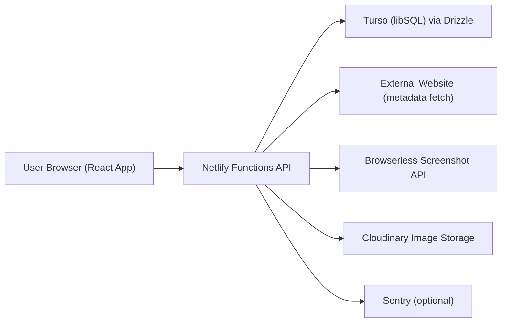
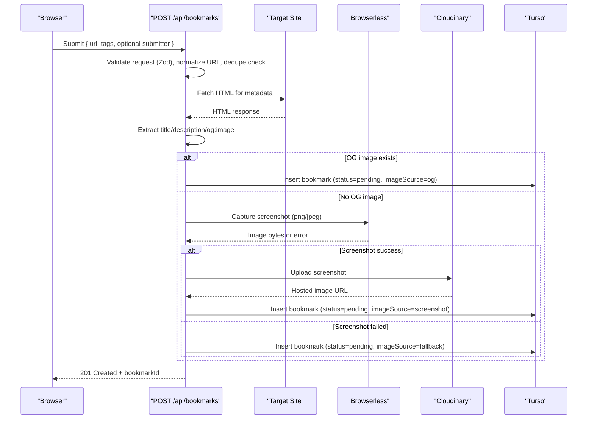
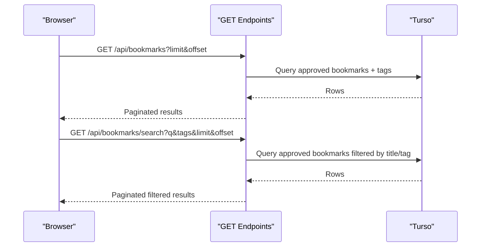
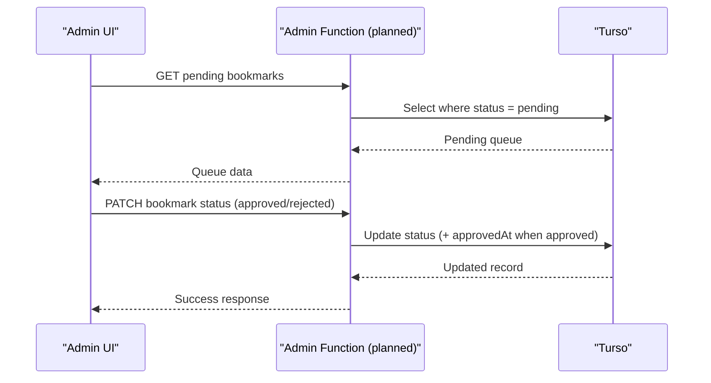

# MakerBench Architecture

Last updated: February 26, 2026

## Purpose

This document is the canonical technical reference for how MakerBench works today and what is planned next.

## System Context

## Runtime Components

- Frontend app: React 19 + TypeScript + Vite
- API layer: Netlify Functions in `netlify/functions`
- Database access: Drizzle ORM + Turso via `netlify/functions/lib/db.ts`
- Validation: Zod schemas in `src/lib/validation.ts`
- External integrations:
  - Metadata fetch + parsing (Cheerio)
  - Browserless screenshot fallback
  - Cloudinary upload for generated screenshots

## Data Model

Primary tables:

- `bookmarks`
  - includes `status` (`pending | approved | rejected`)
  - includes `imageUrl`, `imageSource`, submitter metadata fields
- `tags`
- `bookmark_tags`
  - many-to-many join
  - unique constraint on (`bookmarkId`, `tagId`)

## API Surface

- `POST /api/bookmarks`
  - validates input
  - extracts metadata
  - tries screenshot fallback if no OG image
  - writes bookmark as `pending`
- `GET /api/bookmarks`
  - returns paginated `approved` bookmarks
- `GET /api/bookmarks/search`
  - returns paginated `approved` bookmarks matching query/tags

## Sequence: Submit Bookmark

## Sequence: Browse and Search

## Sequence: Moderation (Planned)

## Current Gaps

- Moderation API and admin UI are not implemented yet
- Submission pipeline stores new entries as `pending`, so approval workflow is required for public visibility

## Operational Notes

- Functions expect server-side env vars (no `VITE_` prefix)
- Browserless screenshots should use supported output types (`png`/`jpeg`)
- Cloudinary stores uploaded screenshots; frontend consumes hosted URLs

## Source Pointers

- Frontend routes: `src/App.tsx`
- Home page flow: `src/pages/HomePage.tsx`
- Submit page flow: `src/pages/SubmitPage.tsx`
- API client: `src/api/bookmarks.ts`
- Functions:
  - `netlify/functions/process-bookmark.mts`
  - `netlify/functions/get-bookmarks.mts`
  - `netlify/functions/search-bookmarks.mts`
- Function shared libs: `netlify/functions/lib/*`
- Schema: `src/db/schema.ts`
