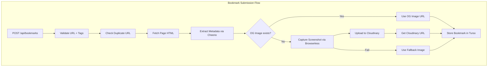

# Phase 1: Foundation & Core Backend Implementation

This plan implements the backend API for bookmark submission, metadata extraction, screenshot capture, and retrieval as defined in the Phase 1 requirements.

## Overview

Build Netlify Functions to accept bookmark submissions, extract metadata using Cheerio, capture screenshots via Browserless, store images on Cloudinary, and persist data to Turso.



## Issue Tracking

All tasks tracked in `bd`. Run `bd ready` to see unblocked work.

| bd ID                 | Task                                                       | Priority |
| --------------------- | ---------------------------------------------------------- | -------- |
| `makerbench-next-kx1` | Install deps: cheerio, cloudinary, @netlify/functions, msw | P1       |
| `makerbench-next-lsy` | Update schema: imageUrl, imageSource, submitter columns    | P1       |
| `makerbench-next-7b2` | Generate and apply database migration                      | P1       |
| `makerbench-next-q03` | Create shared lib for Netlify Functions                    | P1       |
| `makerbench-next-dh4` | Implement metadata extraction service (Cheerio)            | P2       |
| `makerbench-next-d3w` | Implement Browserless screenshot service                   | P2       |
| `makerbench-next-fxs` | Implement Cloudinary upload service                        | P2       |
| `makerbench-next-mro` | Create process-bookmark.mts Netlify Function               | P2       |
| `makerbench-next-ftz` | Create get-bookmarks.mts Netlify Function                  | P2       |
| `makerbench-next-da4` | Create search-bookmarks.mts Netlify Function               | P2       |
| `makerbench-next-ct8` | Set up MSW handlers and Vitest test infrastructure         | P2       |
| `makerbench-next-ls7` | Write unit tests for services                              | P2       |
| `makerbench-next-pk8` | Write integration tests for Netlify Functions              | P2       |

## Key Implementation Files

| File                                     | Purpose                                            |
| ---------------------------------------- | -------------------------------------------------- |
| `netlify/functions/process-bookmark.mts` | Submit new bookmarks                               |
| `netlify/functions/get-bookmarks.mts`    | Retrieve approved bookmarks                        |
| `netlify/functions/search-bookmarks.mts` | Search/filter bookmarks                            |
| `src/db/schema.ts`                       | Add `imageUrl`, `imageSource`, `submitter` columns |
| `src/db/queries/bookmarks.ts`            | Add duplicate check, count queries                 |
| `src/lib/services/metadata.ts`           | Cheerio-based metadata extraction                  |
| `src/lib/services/screenshot.ts`         | Browserless integration                            |
| `src/lib/services/cloudinary.ts`         | Cloudinary upload helper                           |

## Schema Updates

Add to `src/db/schema.ts`:

```typescript
imageUrl: text("image_url"),
imageSource: text("image_source", { enum: ["og", "screenshot", "fallback"] }),
submitterName: text("submitter_name"),
submitterGithubUrl: text("submitter_github_url"),
```

Add unique constraint to `bookmark_tags` for `(bookmarkId, tagId)`.

## Dependencies to Install

```bash
npm install cheerio cloudinary @netlify/functions
npm install -D msw
```

Note: Browserless is called via REST API (no SDK needed).

## Environment Variables

Configure in Netlify UI (not `VITE_` prefix for server-side):

| Variable                | Purpose               |
| ----------------------- | --------------------- |
| `TURSO_DATABASE_URL`    | Turso connection URL  |
| `TURSO_AUTH_TOKEN`      | Turso auth token      |
| `BROWSERLESS_API_KEY`   | Browserless API key   |
| `CLOUDINARY_CLOUD_NAME` | Cloudinary cloud name |
| `CLOUDINARY_API_KEY`    | Cloudinary API key    |
| `CLOUDINARY_API_SECRET` | Cloudinary API secret |

## Database Connection Strategy

Create a separate db client for Netlify Functions at `netlify/functions/lib/db.ts` using `Netlify.env.get()` instead of `import.meta.env`.

## Open Questions Resolved

| Question          | Decision                                                                 |
| ----------------- | ------------------------------------------------------------------------ |
| Timeout strategy  | 15s for page fetch, 30s for screenshot                                   |
| Retry logic       | No retries for MVP; immediate fallback                                   |
| URL normalization | Normalize before duplicate check (remove trailing slash, lowercase host) |
| Tag limit         | 10 tags max per submission                                               |

## Testing Strategy

The project uses Vitest (already configured) with MSW for HTTP mocking.

### Test Infrastructure Files

| File                         | Purpose                                             |
| ---------------------------- | --------------------------------------------------- |
| `src/test/setup.ts`          | Vitest global setup, MSW server start/stop          |
| `src/test/mocks/handlers.ts` | MSW request handlers for Browserless, external URLs |
| `src/test/mocks/server.ts`   | MSW server instance                                 |
| `src/db/__mocks__/index.ts`  | Mock Drizzle db client                              |

### MSW Handlers

```typescript
// src/test/mocks/handlers.ts
import { http, HttpResponse } from "msw";

export const handlers = [
  // Browserless screenshot API
  http.post("https://chrome.browserless.io/screenshot", () => {
    return HttpResponse.arrayBuffer(new ArrayBuffer(100));
  }),

  // Mock external page fetch for metadata extraction
  http.get("https://example.com/*", () => {
    return HttpResponse.html(`
      <html>
        <head>
          <title>Test Page</title>
          <meta property="og:image" content="https://example.com/og.png" />
        </head>
      </html>
    `);
  }),
];
```

### Vitest Setup

```typescript
// src/test/setup.ts
import { beforeAll, afterAll, afterEach } from "vitest";
import { server } from "./mocks/server";

beforeAll(() => server.listen({ onUnhandledRequest: "error" }));
afterEach(() => server.resetHandlers());
afterAll(() => server.close());
```

### Mocking Strategy by Service

| Service               | Mock Method                             |
| --------------------- | --------------------------------------- |
| Browserless           | MSW handler for `chrome.browserless.io` |
| Page fetch (metadata) | MSW handler for target URLs             |
| Cloudinary            | `vi.mock('cloudinary')` - SDK mock      |
| Turso/Drizzle         | `vi.mock('../db')` - DB client mock     |
| Netlify.env           | `vi.stubGlobal('Netlify', {...})`       |

### Test Files

| Test File                                              | Coverage                                |
| ------------------------------------------------------ | --------------------------------------- |
| `src/lib/services/__tests__/metadata.test.ts`          | Cheerio extraction with MSW-mocked HTML |
| `src/lib/services/__tests__/screenshot.test.ts`        | Browserless API via MSW                 |
| `src/lib/services/__tests__/cloudinary.test.ts`        | Upload logic with mocked SDK            |
| `netlify/functions/__tests__/process-bookmark.test.ts` | Full submission flow                    |
| `netlify/functions/__tests__/get-bookmarks.test.ts`    | Retrieval + pagination                  |
| `netlify/functions/__tests__/search-bookmarks.test.ts` | Search + tag filtering                  |

### Testing Approach

- **HTTP calls** (Browserless, page fetch): MSW for realistic request/response mocking
- **SDKs** (Cloudinary): `vi.mock()` for module mocking
- **Database**: Mock Drizzle client returning controlled test data
- **No live API calls** in tests
